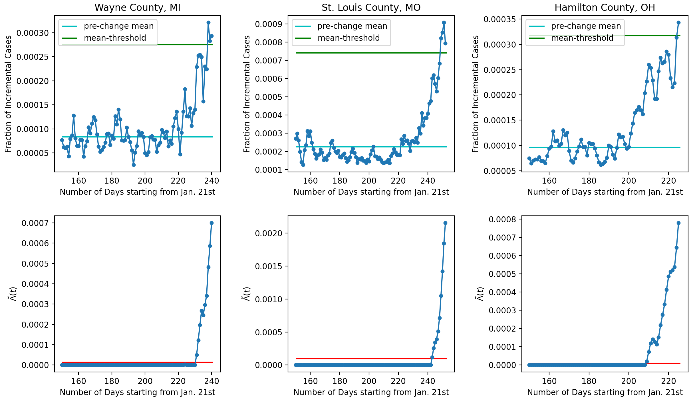

# Non-Parametric Quickest Mean Change Detection

### Paper

arXiv Link: https://arxiv.org/pdf/2108.11348.pdf

### Data

Data source: Rearc. AWS Marketplace: Coronavirus (COVID-19) Data in the United States — The New York Times. Link [here](https://aws.amazon.com/marketplace/pp/prodview-jmb464qw2yg74).

### Covid-19 Monitoring Application

The upper subplot is the three-day moving average of the new cases  of COVID-19 as a fraction of the population in Wayne County, MI (left), St. Louis County, MO (middle), and Hamilton County, OH (right). The x-axis is the number days elapsed after January 21, 2020. The pre-change mean and variance are estimated using data from days 120 to 150. The FAR threshold alpha is set to 0.01, meaning an average of 1 false alarm every 100 observations (days). For each county, the mean-threshold (in green) is set to be 3.3 times of the estimated pre-change mean (in cyan). The lower subplot shows the evolution of the statistic in the corresponding county.
