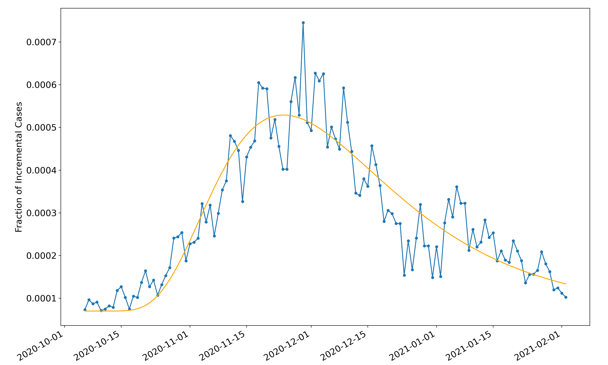
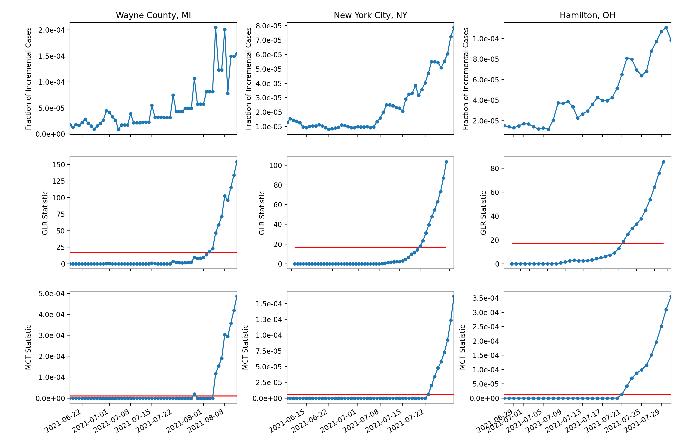

# Non-Parametric Quickest Mean Change Detection

### Paper

arXiv Link: https://arxiv.org/pdf/2110.01581.pdf

### Data

Data source: Rearc. AWS Marketplace: Coronavirus (COVID-19) Data in the United States — The New York Times. Link [here](https://aws.amazon.com/marketplace/pp/prodview-jmb464qw2yg74).

### Covid-19 Monitoring Application

#### Non-stationary Distribution Model

We use the Beta distribution $\mathcal{B}$ to model daily new cases.
* Pre-change: $\mathcal{B}(a_0, b_0)$, assuming $a_0 \ll b_0$
* Post-change: $\mathcal{B}(a_0 h_\theta(n-\nu), b_0)$
where $\nu$ is the change point (deterministic yet unknown) and
$$h_\theta(x) = 1+\frac{10^{\theta_0}}{\theta_2} \exp\left(-\frac{(x-\theta_1)^2}{2 \theta_2^2} \right)$$

Check out [this script](./lognormal_example.py) for an interactive plot for the three parameters.

#### Validation of Distribution Model

The plot shows the four-day moving average of the daily new cases of COVID-19 as a fraction of the population in Wayne County, MI from October 1, 2020 to February 1, 2021 (in blue). The shape of the pre-change distribution $\mathcal{B}(a_0, b_0)$ is estimated using data from the previous 20 days (from September 11, 2020 to September 30, 2021), where $\hat{a}_0 = 20.6$ and $\hat{b}_0 = 2.94 \times 10^5$. The mean of the Beta distributions with the best-fit h is also shown (in orange), which minimizes the mean-square distance between the daily incremental fraction and mean of the Beta distributions. The best-fit parameters are: $\hat{\theta}_0 = 0.464$, $\hat{\theta}_1 = 3.894$, and $\hat{\theta}_2 = 0.445$.

#### COVID-19 Monitoring

The upper row shows the four-day moving average of the daily new cases of COVID-19 as a fraction of the population in Wayne County, MI (left), New York City, NY (middle) and Hamilton County, OH (right). A pre-change $\mathcal{B}(a_0,b_0)$ distribution is estimated using data from the previous 20 days (from May 26, 2021 to June 14, 2021). The plots in the middle row show the evolution of the WL-GLR-CuSum statistic, which are compared with the [MCT](https://github.com/jacksonliang35/Quickest-Change-Detection/tree/main/MCT) statistic in the lower row. The FAR $\alpha = 0.001$ (meaning on average 1 false alarm every 1000 days) and the corresponding thresholds are shown in red. The window size is 20 for WL-GLR-CuSum.
