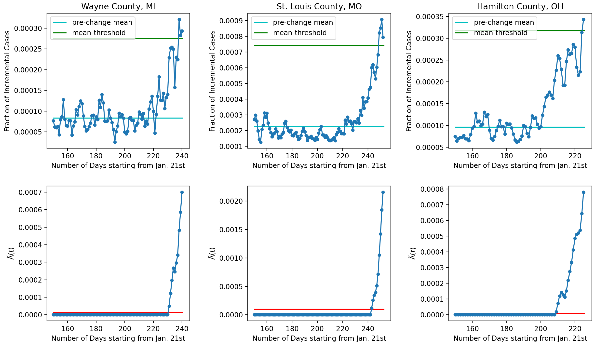
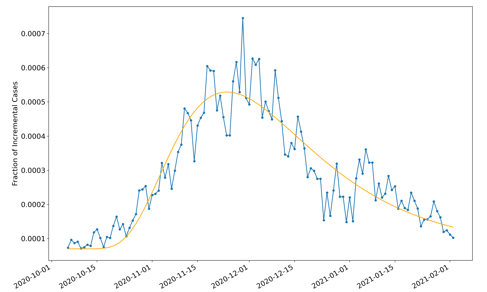
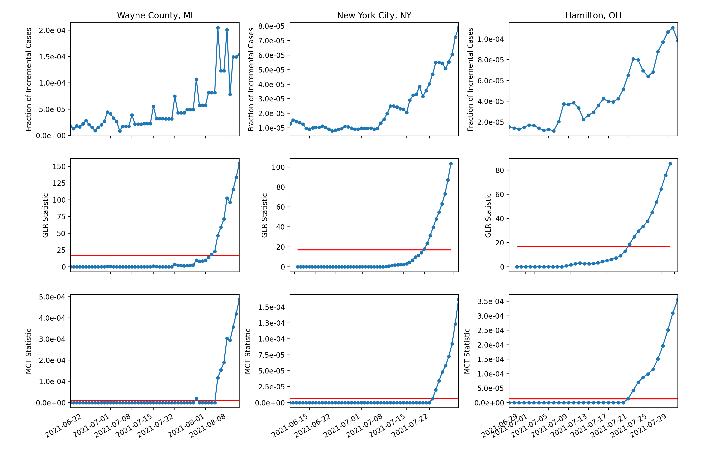

# QCD Application: Pandemic Monitoring

### Goal

The goal is to detect the onset of a new pandemic wave quickly yet reliably (not making too many false alarms).

### Data

Data source: Rearc. AWS Marketplace: Coronavirus (COVID-19) Data in the United States — The New York Times. Check out [here](https://aws.amazon.com/marketplace/pp/prodview-jmb464qw2yg74).

### Algorithm 1: Mean-Change Test (MCT)

The MCT aims to detect the change in mean quickly and reliably. Rather than the full distribution, it only requires knowledge of the mean and the variance.

#### Using MCT for Pandemic Monitoring

The upper subplot is the three-day moving average of the new cases  of COVID-19 as a fraction of the population in Wayne County, MI (left), St. Louis County, MO (middle), and Hamilton County, OH (right). The x-axis is the number days elapsed after January 21, 2020. The pre-change mean and variance are estimated using data from days 120 to 150. The FAR threshold alpha is set to 0.01, meaning an average of 1 false alarm every 100 observations (days). For each county, the mean-threshold (in green) is set to be 3.3 times of the estimated pre-change mean (in cyan). The lower subplot shows the evolution of the statistic in the corresponding county.

### Algorithm 2: WL-GLR-CuSum

The window-limited generalized-likelihood-ratio CuSum (WL-GLR-CuSum) is another test which requires distribution knowledge. We adopt the following non-stationary distribution model.

#### Non-stationary Distribution Model

We use the Beta distribution $\mathcal{B}$ to model daily new cases.
* Pre-change: $\mathcal{B}(a_0, b_0)$, assuming $a_0 \ll b_0$
* Post-change: $\mathcal{B}(a_0 h_\theta(n-\nu), b_0)$
where $\nu$ is the change point (deterministic yet unknown) and
$$h_\theta(x) = 1+\frac{10^{\theta_0}}{\theta_2} \exp\left(-\frac{(x-\theta_1)^2}{2 \theta_2^2} \right)$$

We also provide [a script](./lognormal_example.py) for an interactive plot for these three parameters.

#### Validation of Distribution Model

The plot shows the four-day moving average of the daily new cases of COVID-19 as a fraction of the population in Wayne County, MI from October 1, 2020 to February 1, 2021 (in blue). The shape of the pre-change distribution $\mathcal{B}(a_0, b_0)$ is estimated using data from the previous 20 days (from September 11, 2020 to September 30, 2021), where $\hat{a}_0 = 20.6$ and $\hat{b}_0 = 2.94 \times 10^5$. The mean of the Beta distributions with the best-fit h is also shown (in orange), which minimizes the mean-square distance between the daily incremental fraction and mean of the Beta distributions. The best-fit parameters are: $\hat{\theta}_0 = 0.464$, $\hat{\theta}_1 = 3.894$, and $\hat{\theta}_2 = 0.445$.

### Comparison of MCT and WL-GLR-CuSum

The upper row shows the four-day moving average of the daily new cases of COVID-19 as a fraction of the population in Wayne County, MI (left), New York City, NY (middle) and Hamilton County, OH (right). A pre-change $\mathcal{B}(a_0,b_0)$ distribution is estimated using data from the previous 20 days (from May 26, 2021 to June 14, 2021). The plots in the middle row show the evolution of the WL-GLR-CuSum statistic, which are compared with the MCT statistic in the lower row. The FAR $\alpha = 0.001$ (meaning on average 1 false alarm every 1000 days) and the corresponding thresholds are shown in red. The window size is 20 for WL-GLR-CuSum.

### Related Papers

* Y. Liang, A. G. Tartakovsky, and V. V. Veeravalli, “Quickest Change Detection with Non-Stationary Post-Change Observations”, in IEEE Transactions on Information Theory, vol. 69, no. 5, pp. 3400-3414, 2023.
* Y. Liang and V. V. Veeravalli, “Non-Parametric Quickest Mean-Change Detection,” in IEEE Transactions on Information Theory, vol. 68, no. 12, pp. 8040-8052, 2022.
* Y. Liang and V. V. Veeravalli, “Quickest Detection of Composite and Non-Stationary Changes with Application to Pandemic Monitoring,” ICASSP 2022 - 2022 IEEE International Conference on Acoustics, Speech and Signal Processing (ICASSP), Singapore, Singapore, 2022, pp. 5807-5811.
* Y. Liang and V. V. Veeravalli, “Non-Parametric Quickest Detection of a Change in the Mean of an Observation Sequence,” 2021 55th Annual Conference on Information Sciences and Systems (CISS), Baltimore, MD, USA, 2021, pp. 1-6.
