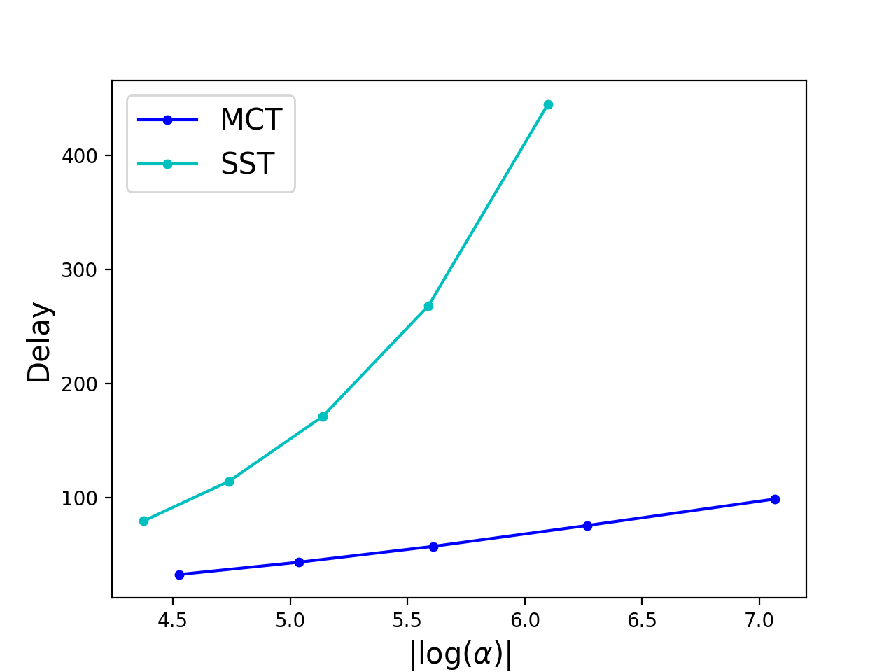

# Quickest-Change-Detection

### General Problem Introduction

#### Goal

Given sequential observations whose distribution (possibly) changes at some time, the goal is to detect the change in distribution as quickly as possible after it occurs, while not making too many false alarms.

#### QCD as Optimization

We are given sequential input at each time, denoted as $(X_n)$, each distributed as some pre-change density $p_0$ (nominal distribution). At some unknown time $\nu$ (a.k.a. change-point), the underlying distribution of each $X_\nu, X_{\nu+1}, \dots$ suddenly changes to $p_1$ (anomalous distribution).

We want to design a change detector which monitors the sequence. The goal is to design a good stopping time $\tau$, at which we stop taking observations and declare that the change has occurred.

What characterizes a good stopping time? A traditional criterion is to solve the following optimization problem [1] (Lorden, 1971). Given that the false alarm rate does not exceed $\alpha$, we want to minimize the expected delay before making an alarm. Mathematically, given that

$$E_\infty[\tau] \geq \alpha^{-1},$$

one aims to minimize the delay, defined as

$$\texttt{WADD}(\tau) := \sup_{\nu \geq 1} \texttt{esssup} E_\nu [(\tau-\nu+1)^+ | X_1,\dots,X_{\nu-1}].$$

Note that $E_\infty$ is the expectation operator when the change never happens.

### Why Sequential Algorithms?

One common way to perform change detection is to first collect some of the most recent samples and perform fixed-sample-size (FSS) hypothesis testing at each time. However, it has been shown theoretically that FSS tests on average require more samples than do sequential tests [2]. This is also illustrated in the following figure.

It can be observed that at the same false alarm level, the SST requires much more samples than the MCT.

### Some Applications

* [Pandemic Monitoring](Pandemic-Monitoring/)
* [Passing Object Detection](IoBT/)

[1] G. Lorden, "Procedures for reacting to a change in distribution," The Annals of Mathematical Statistics, vol. 42, no. 6, pp. 1897–1908, Dec. 1971.

[2] P. Moulin and V. V. Veeravalli, Statistical Inference for Engineers and Data Scientists. Cambridge, UK: Cambridge University Press, 2018.
